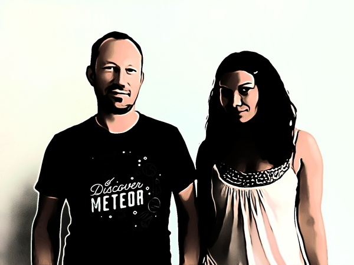

# The Founders

Monique and Martin have been a team for 10 years. Together they have been using their brains and technology to solve people's problems.

*Monique Duarte, CEO*
7 years  experience as Co-founder and Head of Design at a London-based Digital Agency  (Morango).
Product Development & UX Expert.
Communications background – Journalism. 
Studied Law @ Queen Mary University of London.
[@MoniqueMDuarte](http://twitter.com/moniquemduarte)

*Martin Szyllo, CTO*
24 years of commercial software development experience. 
CTO and Co-founder of a London-based Digital Agency (Morango).
Previously founded e-Knowledge, acquired by MB Tech (JSE listed).
Studied Computer Science @ The American University of Paris & MBA (EBS).
[@MartiniPub](http://twitter.com/martinipub)

We are disrupting the traditional publishing industry that is in terminal decline and leading the revolution for all those who love literature.
